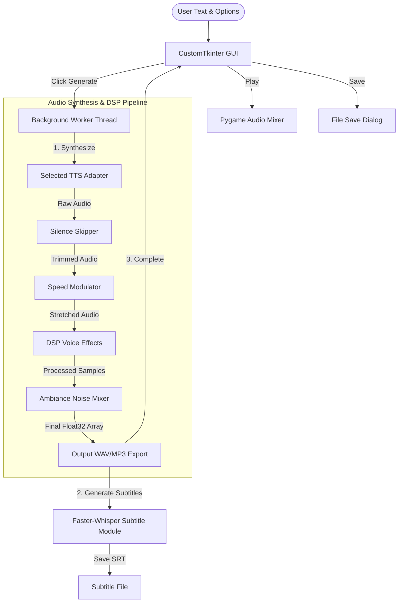

# VoiceCraft Developer & Architecture Guide

Welcome to the **VoiceCraft** codebase guide. This document serves as a technical manual for developers, designers, and AI agents. It describes the application's structure, explains the system architecture, and provides step-by-step guides on how to extend the platform with new text-to-speech (TTS) engines, audio effects, and customizations.

---

## 📖 Table of Contents
1. [Application Overview](#-application-overview)
2. [File Dictionary](#-file-dictionary)
3. [System Architecture](#-system-architecture)
4. [How to Add a New TTS Engine](#-how-to-add-a-new-tts-engine)
5. [How to Add a New Voice Effect](#-how-to-add-a-new-voice-effect)
6. [Audio Customization Deep-Dive](#-audio-customization-deep-dive)
7. [Building & Running the App](#-building--running-the-app)
8. [Model Weights & Troubleshooting](#-model-weights--troubleshooting)

---

## 🎙 Application Overview

**VoiceCraft** is a modular, desktop-based Text-to-Speech (TTS) Studio built in Python. It provides a premium, responsive dark-themed dashboard using CustomTkinter, allowing users to synthesize high-quality speech from text and apply real-time DSP (Digital Signal Processing) effects. 

### Key Highlights
* **Multi-Engine Support**: Supports cloud-based APIs (Google Translate TTS, Microsoft Edge Neural) and local offline AI models (Kokoro-82M, MeloTTS, Piper TTS, and local system SAPI5 voices).
* **Numpy-Based DSP Pipeline**: Apply 18+ voice effects (Vocoder, Glitch, Reverb, Pitch Shifting) and curated social media profiles (ASMR Cinematic, SaaS Flash, YouTube Reviewer).
* **Real-time Audio Customizations**: Fine-tune speed, strip silent pauses automatically, mix background ambiance (airplane rumble, forest crickets, or custom imports), and generate synced SRT subtitles.
* **Responsive Architecture**: Decoupled UI widgets and a multi-threaded execution queue ensure that the GUI never freezes during heavy local neural generation.

---

## 📁 File Dictionary

Below is the directory structure mapping each component of the VoiceCraft application to its technical role:

| Path | File / Folder Type | Description |
| :--- | :--- | :--- |
| `tts_app.py` | Entry Point Script | The main application entry point. Initializes the CustomTkinter runtime and starts `VoiceCraftApp`. |
| `run.ps1` | Shell Script | PowerShell launcher that automatically checks for and triggers the application via the local virtual environment (`venv_311`). |
| `requirements.txt` | Package Dependencies | Dependencies grouped per engine, plus GUI, playback and DSP libraries. Ends with a note on why `kokoro-onnx` must be installed separately with `--no-deps`. |
| `build_exe.py` | Packaging Script | PyInstaller compilation script that bundles dependencies (PyTorch, ONNX Runtime, CustomTkinter) into a portable executable. Refuses to run from an interpreter that cannot import every engine library, and refuses to bundle truncated Kokoro weights. Outputs `dist/TTS_Studio/TTS_Studio.exe`. |
| `installer.iss` | Inno Setup Script | Packages the `dist/TTS_Studio/` PyInstaller output into a distributable Windows installer (`VoiceCraft-Setup-<version>.exe`) with Start Menu shortcuts, optional desktop icon, and an uninstaller. |
| **`core/`** | Directory | Shared module containing core configuration parameters and system utilities. |
| `├── constants.py` | Configuration Module | Holds application-wide design tokens (colors, font configurations) and static lists of languages/voices. |
| `├── model_cache.py` | Model Cache | Thread-safe, idle-expiring cache (`MODEL_CACHE`) for heavy TTS/ASR models. Reuses loaded instances between generations and evicts them after 5 minutes idle, returning CUDA memory to the OS. |
| `├── temp_cleanup.py` | Housekeeping | Sweeps orphaned `tts_studio_*` temp directories left behind by a crash or force-quit. Called on startup. |
| `└── subtitles.py` | Transcription Module | Word-level subtitle generation wrapper using `faster-whisper`. Manages dynamic GPU/CPU loading and VRAM unloading. |
| **`engines/`** | Directory | Contains abstract interfaces and concrete adapters for various TTS engines. |
| `├── base.py` | Class Interface | Declares `BaseTTSEngine`, the abstract base class that all TTS adapters must inherit and implement. |
| `├── registry.py` | Engine Registry | Central registration file (`ENGINE_CLASSES`). Determines which engines are activated and in what order they appear in the UI. |
| `├── gtts_engine.py` | TTS Engine Adapter | Google Translate TTS API wrapper (requires internet connection). Outputs `.mp3`. |
| `├── edge_engine.py` | TTS Engine Adapter | Microsoft Edge Neural Voices API wrapper (requires internet connection). Outputs `.mp3`. |
| `├── kokoro_engine.py` | TTS Engine Adapter | Kokoro-82M adapter with two backends. Prefers local `kokoro-v1.0.onnx` weights to avoid Hugging Face network freezes on startup, and falls back to the PyTorch `KPipeline`. Verifies the weights are complete before loading them. |
| `├── piper_engine.py` | TTS Engine Adapter | Local, offline fast speech engine adapter utilizing `.onnx` voices. |
| `├── melo_engine.py` | TTS Engine Adapter | MeloTTS multi-lingual offline neural engine adapter. |
| `└── pyttsx3_engine.py` | TTS Engine Adapter | Local offline adapter using standard OS speech engines (SAPI5 on Windows). |
| **`effects/`** | Directory | Digital Signal Processing (DSP) files. |
| `├── audio_effects.py` | DSP Library | Static class containing numerical calculations (using NumPy and Librosa) for pitch, speed, vocoders, ambiance mixers, and filters. |
| `└── registry.py` | Effects Registry | Declares `EFFECTS_REGISTRY`, configuring how each voice effect is displayed, toggled, and called. |
| **`ui/`** | Directory | GUI presentation layer. |
| `├── app.py` | Core GUI Controller | The main window class `VoiceCraftApp`. Orchestrates the background thread worker, playback systems, and save actions. |
| `├── theme.py` | UI Factory | Helper functions for creating CustomTkinter standard panels, dropdowns, sliders, and switches. |
| `└── panels/` | Directory | Custom panel sub-widgets. |
| `    ├── text_panel.py` | GUI Widget | Renders the text area and updates the live character count. |
| `    ├── engine_panel.py` | GUI Widget | Engine dropdown, GPU toggle, and dynamically swapped configuration screens for each engine. |
| `    ├── effects_panel.py` | GUI Widget | Displays visual toggle cards for each effect registered in the effects registry. |
| `    ├── customization_panel.py` | GUI Widget | Contains speed sliders, silence skipping, background ambiance selectors, and sub-tracks. |
| `    └── playback_panel.py` | GUI Widget | Renders the primary action buttons (Generate, Play, Stop, Save MP3, Save SRT, Open Folder) and progress bars. |
| **`models/`** | Directory | Storage for local model files (e.g. Piper `.onnx` files). |
| **`output/`** | Directory | Default folder where audio and subtitles are exported. |

---

## 🏗 System Architecture

VoiceCraft utilizes a decoupled, event-driven design. The user interface does not run synthesis operations directly. Instead, generation is offloaded to a worker thread that manages the synthesis and audio processing pipeline before reporting back to the UI.

### 1. Data Flow Diagram



### 2. Multi-Threading & UI Protection
Because neural networks (MeloTTS, Kokoro, Piper) require substantial CPU/GPU compute, running synthesis on the main Tkinter thread would cause the UI to crash or become unresponsive. 
* The UI spawns a daemon thread `threading.Thread(target=self._generate_worker, args=(text,), daemon=True).start()`.
* Communications back to the UI (e.g. updating progress bars, editing status text, opening error dialogs) are scheduled using the safe Tkinter event loop scheduler `self.after(0, callback, args)`.
* A cancellation signal `self._stop_event` (a `threading.Event`) is periodically checked by the worker thread and the active engine to abort synthesis instantly.

---

## 🔌 How to Add a New TTS Engine

Adding a new engine requires creating an adapter class and registering it. 

### Step 1: Create the Adapter Class
Create a new file under `engines/my_new_engine.py` and implement the two mandatory abstract methods from `BaseTTSEngine`:

```python
"""
engines/my_new_engine.py
"""
import os
from engines.base import BaseTTSEngine

# Try importing the engine's external libraries
try:
    import my_cool_tts_library
    _AVAILABLE = True
except ImportError:
    _AVAILABLE = False


class MyCoolEngine(BaseTTSEngine):
    # Unique label shown in the UI dropdown
    name = "My Cool TTS Engine (Local AI)"

    @staticmethod
    def is_available() -> bool:
        """Return True if the engine's libraries and models are ready to load."""
        return _AVAILABLE

    def synthesize(self, text: str, tmp_dir: str, **kwargs) -> dict:
        """
        Synthesize text and write the output file into the temp directory.
        
        Parameters
        ----------
        text : str
            The input text to speak.
        tmp_dir : str
            A temporary directory to write files.
        **kwargs : dict
            Settings passed from the UI (e.g. rate, speed, voice_key).
            
        Returns
        -------
        dict with keys:
            playback_file: str - path to the file used by pygame for playback
            save_file: str     - path to the file offered for saving
            save_ext: str      - default file extension (e.g. ".wav", ".mp3")
        """
        status_cb = kwargs.get("status_cb", None)
        voice_id = kwargs.get("voice_key", "default_voice")

        if status_cb:
            status_cb("Running cool synthesis...")

        output_path = os.path.join(tmp_dir, "cool_output.wav")
        
        # Call the third-party synthesis API
        my_cool_tts_library.speak_to_file(text, output_path, voice=voice_id)

        return {
            "playback_file": output_path,
            "save_file": output_path,
            "save_ext": ".wav"
        }
```

### Step 2: Register in `engines/registry.py`
Import the new engine adapter and append it to `ENGINE_CLASSES`:

```python
# engines/registry.py
# ...
from engines.my_new_engine import MyCoolEngine  # Add this

ENGINE_CLASSES = [
    GTTSEngine,
    EdgeEngine,
    KokoroEngine,
    PiperEngine,
    MeloEngine,
    Pyttsx3Engine,
    MyCoolEngine,  # Add this
]
```

### Step 3: Add UI Configurations (Optional)
If your engine has specific settings (e.g., custom voice maps or speed parameters):
1. **Define Constants**: Add voice directories to [constants.py](file:///e:/Develop/Antigravity_testing/tts_app%20modular/core/constants.py).
2. **Build Settings Frame**: Open [engine_panel.py](file:///e:/Develop/Antigravity_testing/tts_app%20modular/ui/panels/engine_panel.py). Add a `_build_my_cool_engine_frame()` method mimicking existing builders, storing widgets in `self._sub_frames["my_cool_engine"]`.
3. **Register Switcher**: Add your engine's string identifying keyword into `key_map` inside the `_on_engine_change()` method.
4. **Collect Settings**: Update `get_settings()` to include your new GUI widget values in the returned dictionary.

---

## ✨ How to Add a New Voice Effect

Adding a voice effect is entirely configuration-driven. The GUI automatically builds the cards and checkbox bindings based on the central registry.

### Step 1: Implement the DSP Method
Open [audio_effects.py](file:///e:/Develop/Antigravity_testing/tts_app%20modular/effects/audio_effects.py). Add a static method that receives float32 NumPy samples, processes them, and returns a modified float32 NumPy array:

```python
# effects/audio_effects.py
# ...
class AudioEffects:
    # ... (existing effects)

    @staticmethod
    def alien_vibrato(samples, sr, rate_hz=6.0, depth=0.4):
        """
        Creates a modulating frequency shifter (vibrato effect).
        """
        n = len(samples)
        t = np.arange(n, dtype=np.float32) / sr
        
        # Sine wave LFO
        lfo = np.sin(2 * np.pi * rate_hz * t) * depth
        
        # Naive ring-like modulation to create pitch vibes
        modulated = samples * (1.0 + lfo)
        
        # Always normalize output to prevent digital clipping
        mx = np.max(np.abs(modulated))
        if mx > 0:
            modulated = modulated / mx * 0.9
            
        return modulated.astype(np.float32)
```

### Step 2: Register in `effects/registry.py`
Open [registry.py](file:///e:/Develop/Antigravity_testing/tts_app%20modular/effects/registry.py) and insert your new effect dictionary into `EFFECTS_REGISTRY`:

```python
# effects/registry.py
# ...
EFFECTS_REGISTRY = [
    {
        "key":    "alien_vib",
        "label":  "👽  Alien Vibrato",
        "desc":   "Modulating vibrato filter",
        "fn":     AudioEffects.alien_vibrato,
        "kwargs": {"rate_hz": 8.0, "depth": 0.5}, # Optional: Override defaults
    },
    # ... (Keep normalization at the very bottom)
]
```

The app will dynamically render the toggle switch, wire the `BooleanVar` state, and execute the DSP function in the order specified in the registry.

---

## 🎧 Audio Customization Deep-Dive

VoiceCraft implements a post-processing pipeline that runs sequentially in the following order:

1. **Silence Skipping** (if enabled; crops silent periods using `pydub`)
2. **Speed Adjustment** (if speed is non-default; resamples or uses phase vocoder)
3. **Voice Effects Loop** (applies enabled effects from `EFFECTS_REGISTRY` sequentially, skipping the `normalize` step for later execution)
4. **Background Ambiance Mix** (if enabled; mixes in synthetic or custom audio soundscapes)
5. **Normalization Pass** (if enabled; executed at the **very end** of the pipeline so that the combined speech + effects + ambiance signal is properly scaled to a peak level of $-3.0dB$ without clipping)

Here is how each step operates:

### 1. Skip Silences
* **Module**: [app.py](file:///e:/Develop/Antigravity_testing/tts_app%20modular/ui/app.py) (`_generate_worker`)
* **Mechanism**: Uses `pydub.silence.split_on_silence` with a threshold of `-40 dB` and a minimum silence duration of `200ms`. Speech chunks are identified, extracted, and concatenated. This removes unnatural pauses generated by local neural networks.

### 2. Time-Stretching (Speed Adjustment)
* **Module**: [audio_effects.py](file:///e:/Develop/Antigravity_testing/tts_app%20modular/effects/audio_effects.py) (`change_speed`)
* **High Quality (Default)**: If `librosa` is installed, it utilizes **Phase Vocoder** time-stretching (`librosa.effects.time_stretch`). This speeds up or slows down the narration *without* altering the pitch or voice timbre.
* **Low Quality (Fallback)**: If `librosa` is missing, it falls back to basic linear interpolation `np.interp`, resulting in a pitch shift (e.g., faster speeds sound high-pitched and "chipmunk-like").

### 3. Background Ambiance Mixer
* **Module**: [audio_effects.py](file:///e:/Develop/Antigravity_testing/tts_app%20modular/effects/audio_effects.py) (`add_environment_sound`)
* **Synthetic Tracks**: 
  * *Airplane Cabin*: Blends deep, low-passed engine rumble (LPF at $70Hz$, $55\%$), muffled air cabin flow whoosh (LPF at $200Hz$, $35\%$), and a soft turbine engine hum harmonic series ($75Hz$, $150Hz$, $225Hz$, $10\%$) to mimic insulated airline acoustics rather than high-frequency television static.
  * *Nature/Forest*: Blends gentle pink noise wind with a high-frequency carrier sine ($4200Hz$) modulated at $3Hz$ to simulate cricket chirps.
* **Custom Imports**: Reads an uploaded file (`.wav`, `.mp3`), resamples it to match the main TTS stream, loops it if it is shorter than the speech track, and mixes the channels using a soft-clipping factor:
  $$\text{Mix} = \text{Speech} + \text{Ambiance} \times \text{Volume}$$
  If the combined signal clipping threshold ($1.0$) is breached, it divides the array by the max amplitude to prevent harsh digital distortion.

---

## 🛠 Building & Running the App

### Running Locally
To launch the application from source code:
1. Ensure Python 3.11 is installed.
2. Initialize your virtual environment:
   ```powershell
   python -m venv venv_311
   .\venv_311\Scripts\python.exe -m pip install -r requirements.txt
   .\venv_311\Scripts\python.exe -m pip install --no-deps kokoro-onnx
   ```
   > **Always call the venv interpreter by path.** On this machine bare `python`
   > is 3.13 and `venv_311\Scripts\pip.exe` still points at the venv this one was
   > copied from, so `pip install ...` lands in the wrong environment and the
   > package appears missing to the running app.
3. Run the powershell script to boot the application:
   ```powershell
   .\run.ps1
   ```

### Compiling to Portable EXE
You can package VoiceCraft into a standalone Windows directory:
1. Run [build_exe.py](file:///e:/Develop/Antigravity_testing/tts_app%20modular/build_exe.py) **with the venv interpreter**:
   ```powershell
   .\venv_311\Scripts\python.exe build_exe.py
   ```
   PyInstaller bundles whatever the *running* interpreter can import, so a bare
   `python build_exe.py` silently produces an EXE without Kokoro, Piper, MeloTTS
   or subtitles. `_check_interpreter()` now aborts the build and names the
   missing packages rather than shipping a partial bundle.
2. The compilation system runs PyInstaller with instructions to gather dependencies like PyTorch, ONNX, and CustomTkinter automatically, and bundles local files (like the `models/` folder, `kokoro-v1.0.onnx`, and `voices.bin` if present) using PyInstaller's `--add-data` configuration so the app runs fully self-contained.
3. Once completed, the distribution is saved in the `./dist/TTS_Studio/` folder (~6.0 GB, dominated by PyTorch). Run `TTS_Studio.exe` to launch the portable app.

### Building a Windows Installer (Setup.exe)
For end users, a proper installer is preferable to distributing the raw portable folder. [installer.iss](file:///e:/Develop/Antigravity_testing/tts_app%20modular/installer.iss) is an [Inno Setup](https://jrsoftware.org/isinfo.php) script that wraps the PyInstaller output into a signed-ready `Setup.exe`.

1. Install Inno Setup 6 (one-time): `winget install JRSoftware.InnoSetup`.
2. Build the portable app first (`.env_311\Scripts\python.exe build_exe.py`) — the installer script packages whatever is currently in `dist/TTS_Studio/`.
3. Compile the installer:
   ```powershell
   & "$env:LOCALAPPDATA\Programs\Inno Setup 6\ISCC.exe" installer.iss
   ```
4. The resulting installer is written to `installer_output/VoiceCraft-Setup-<version>.exe` (gitignored, same as `dist/` and `build/`).

The installer:
* Installs to `%LocalAppData%\Programs\VoiceCraft` by default and does **not** require admin rights (`PrivilegesRequired=lowest`).
* Adds Start Menu shortcuts and a standard uninstaller entry under "Apps & Features".
* Offers an optional desktop icon (unchecked by default) and can launch the app immediately after install.
* Bump `MyAppVersion` at the top of `installer.iss` before cutting a new release.
* No custom app icon is currently bundled — `installer.iss` falls back to Inno Setup's default icon for shortcuts. Add an `.ico` file and reference it via `SetupIconFile` / `IconFilename` to brand it.

---

## 🩺 Model Weights & Troubleshooting

### Which engines appear in the dropdown

The engine list is **not** hardcoded. `get_available_engines()` in
[registry.py](file:///e:/Develop/Antigravity_testing/tts_app%20modular/engines/registry.py)
filters `ENGINE_CLASSES` by each class's `is_available()`, and
`EnginePanel` renders whatever survives. Most adapters set `_AVAILABLE` from a
bare `try: import ...` at module scope, so **a missing library silently removes
its engine from the UI** with no error anywhere.

If the dropdown is short, check the adapter's import rather than the UI:

```powershell
.\venv_311\Scripts\python.exe -c "from engines.registry import ENGINE_CLASSES; [print(c.is_available(), c.name) for c in ENGINE_CLASSES]"
```

`KokoroEngine` is the exception: it forces `_AVAILABLE = True` because it can
fall back between two backends, so it always appears and reports problems at
synthesis time instead.

### Kokoro has two backends

| Backend | Weights | Notes |
| :--- | :--- | :--- |
| ONNX (preferred) | `kokoro-v1.0.onnx` + `voices.bin` in the project root | Needs `kokoro-onnx`. Avoids a Hugging Face round trip on startup. |
| PyTorch (fallback) | `hexgrad/Kokoro-82M` via the HF cache | Needs `kokoro` + `misaki`. Slower to load. |

`_get_pipeline()` tries ONNX, then PyTorch, then ONNX once more. If everything
fails it raises a single error quoting **both** causes. Do not let the final
ONNX attempt raise on its own: it hides why PyTorch failed first, which is
exactly the trap that made a truncated model look like a PyTorch bug.

### Weight files

Both are gitignored (`*.onnx`, `voices.bin`) and are never committed:

| File | Exact size | Source |
| :--- | ---: | :--- |
| `kokoro-v1.0.onnx` | 325,532,387 bytes | `thewh1teagle/kokoro-onnx` release `model-files-v1.0` |
| `voices.bin` | 28,214,398 bytes | same release, `voices-v1.0.bin` |

A **truncated** download is the dangerous case. It keeps a valid ONNX header, so
`os.path.exists()` is satisfied and PyInstaller bundles it happily, but
onnxruntime fails at load with the unhelpful
`INVALID_PROTOBUF : Protobuf parsing failed`. Two guards now prevent this:

* `_download_with_progress()` compares bytes received against `Content-Length`
  and refuses to promote a short `.part` file.
* `_onnx_is_complete()` reads the length the file's own protobuf header declares
  for its `graph` field and compares it to the file size, for the cost of 64
  bytes. `_get_pipeline()` deletes weights that fail this and re-downloads;
  `build_exe.py` aborts rather than bundling them.

To check a file by hand:

```powershell
.\venv_311\Scripts\python.exe -c "from engines.kokoro_engine import _onnx_is_complete; print(_onnx_is_complete('kokoro-v1.0.onnx'))"
```

### Environment traps on this machine

* Bare `python` is **3.13**, not the project's 3.11 venv.
* `venv_311\Scripts\pip.exe` still resolves to the venv this one was copied
  from, so it installs into a different environment. Use
  `.\venv_311\Scripts\python.exe -m pip` instead, and trust
  `importlib.metadata` over `pip list` when they disagree.
* `kokoro-onnx` depends on `phonemizer>=3.4.0`, which installs over the
  `phonemizer-fork` that `kokoro` and `misaki` need, since both ship the same
  `phonemizer` module. Install it last with `--no-deps`.

To audit a finished build, the PyInstaller TOC records absolute source paths:

```powershell
Select-String -Path build\TTS_Studio\COLLECT-00.toc -Pattern "site-packages" | Select-Object -First 3
```

If those point anywhere other than `venv_311`, the EXE was built by the wrong
interpreter and will be missing engines.
